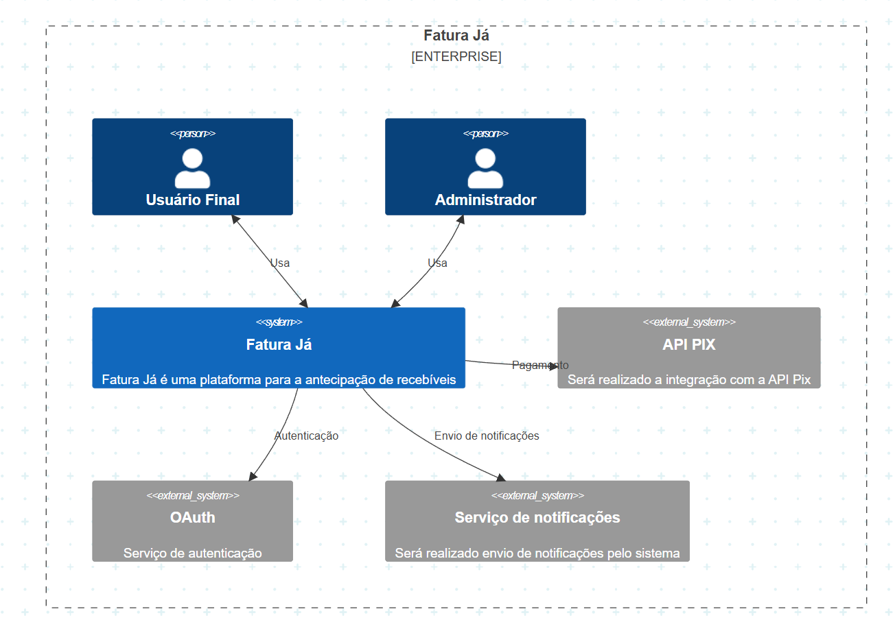

<h1>Fatura Já - Plataforma de Antecipação de Recebíveis</h1>

Fatura Já é uma plataforma para a antecipação de recebíveis com foco em notas fiscais. Através da plataforma, empresas podem antecipar valores de suas faturas de forma rápida, segura e sem complicação, melhorando seu fluxo de caixa e possibilitando crescimento acelerado. O sistema oferece transparência e segurança, proporcionando aos stackholders uma nova forma de aplicar recursos com risco calculado.

<h2>Objetivo</h2>

O FaturaFlow permite que empresas que emitem faturas possam antecipar seus recebíveis, convertendo as faturas em dinheiro imediato. Os investidores, por sua vez, têm a oportunidade de financiar essas faturas, recebendo uma taxa de retorno atrativa.

A Fatura Já contemplará

- Cadastro de Faturas: Empresas podem cadastrar suas faturas na plataforma.
- Antecipação de Recebíveis: Empresas escolhem faturas para antecipar e recebem ofertas de investidores.
- Investidores: Visualizam faturas disponíveis para compra, investindo diretamente nelas.
- Processamento de Pagamentos: Pagamentos via Pix
- Segurança: Blockchain para garantir transparência e registros imutáveis de transações.

<h2>Stacks</h2>

- Java e Microserviços em Spring Boot
- Ethereum - Solidity
- MySQL e NoSQL
- RabbitMQ
- API de Pagamento - Pix
- JWT
- Redis
- Angular
- Docker

<h2>Requisitos Funcionais</h2>

- RF001 - O sistema deve permitir que empresas importem suas notas fiscais (NF-e) via upload de XML ou integração.
- RF002 - O sistema deve validar os dados das NF-es conforme regras fiscais e internas.
- RF003 - O sistema deve permitir a consulta das NF-es cadastradas.
- RF004 - O usuário pode solicitar antecipação com base nas notas cadastradas.
- RF005 - O sistema deve calcular o valor líquido da operação.
- RF006 - O sistema deve permitir simular diferentes cenários de antecipação.
- RF007 - O sistema deve gerar o contrato da operação.
- RF008 - O sistema deve consultar a situação financeira da empresa.
- RF009 - O sistema deve gerar uma pontuação interna de risco.
- RF010 - Empresas com alto risco terão operações bloqueadas.
- RF011 - O administrador deve aprovar ou rejeitar a solicitação.
- RF012 - O sistema deve enviar notificações automáticas.
- RF013 - O sistema deve realizar o pagamento ao cliente.
- RF014 - O sistema deve gerar relatórios financeiros.
- RF015 - O sistema deve manter um log de auditoria.
- RF016 - O sistema deve permitir o cadastro e gestão dos dados das empresas clientes.
- RF017 - O sistema deve ter controle de usuários e permissões.
- RF018 - O sistema deve manter um histórico completo de todas as operações.
- RF019 - O sistema deve possuir um painel com indicadores visuais.

<h2>Requisitos Não Funcionais</h2>

- RNF001 - O sistema deve ser desenvolvido utilizando arquitetura de microserviços desacoplados.
- RNF002 - O sistema deve ser capaz de escalar horizontalmente.
- RNF003 - O sistema deve seguir boas práticas de segurança.
- RNF004 - As APIs devem seguir o padrão RESTful.
- RNF005 - O sistema deve processar cada requisição em menos de 1 segundo, em média.
- RNF006 - O sistema deve possuir pipeline de CI/CD automatizado.
- RNF007 - O sistema deve ter uma interface web amigável e intuitiva.
- RNF008 - As APIs devem ser versionadas.
- RNF009 - O sistema deve ser robusto o suficiente para lidar com operações financeiras sensíveis, evitando erros críticos que possam comprometer o processamento de notas fiscais ou antecipações de recebíveis.
- RNF010 - O sistema deve garantir que todas as transações de antecipação e análise de crédito sejam processadas corretamente, mantendo integridade total dos dados.
- RNF011 - O sistema deve garantir que todas as transações de antecipação e análise de crédito sejam processadas corretamente, mantendo integridade total dos dados.
- RNF012 - O sistema deve garantir consistência dos dados em todas as operações, principalmente em processos distribuídos entre os microserviços (transações financeiras e atualizações de status das notas).
- RNF013 - O sistema deve manter um histórico de logs e trilha de auditoria de todas as operações realizadas pelos usuários e processos automáticos.
- RNF014 - O sistema deve ter uma interface amigável, com fluxo de navegação simplificado, focando na clareza das informações financeiras e facilidade para solicitação de antecipações.
- RNF015 - O sistema deve ser resiliente a falhas parciais, garantindo que, mesmo se um microserviço estiver fora do ar temporariamente, as demais funcionalidades não sejam interrompidas.
- RNF016 - O sistema deve permitir a expansão futura para incluir novas funcionalidades no domínio financeiro, como factoring, análise de crédito mais avançada ou até financiamento de fornecedores.
- RNF017 - O sistema deve responder às solicitações de antecipação de recebíveis em tempo real ou em até 5 segundos, considerando processamento de crédito e validação de notas fiscais.
- RNF018 - O sistema deve ser modular e de fácil manutenção, permitindo atualizações em microserviços de forma isolada, sem impactar o funcionamento global.
- RNF019 - O sistema deve estar disponível para as empresas clientes e administradores pelo menos 24/7, salvo em períodos programados de manutenção.
- RNF020 - O sistema deve suportar o cadastro e operação de múltiplas empresas (clientes) dentro da mesma plataforma, sem que uma tenha acesso aos dados da outra.
- RNF021 - O sistema deve seguir o escopo financeiro de antecipação de recebíveis com suporte total à gestão de notas fiscais eletrônicas, validação junto à Sefaz e cálculo de desconto financeiro baseado em regras predefinidas.
- RNF022 - O sistema deve fornecer interfaces seguras para integração com sistemas externos de pagamento

<h1>C4 Model</h1>

<h3>C1 - Diagrama de Contexto </h1>

